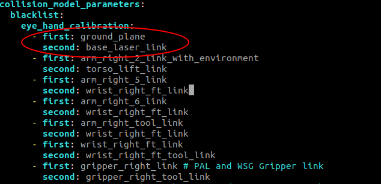

# TIAGO DUAL EXAMPLES

## Purpose of the repo
This repository contains 6 scripts that allow controlling tiago++ robot's movements, on top of the last section contains troubleshooting steps that have solved the issues that I had with hand-eye calibration process for the robot.
## How to use it?
To setup the repository for ROS Noetitc use run the following commands:
```bash
git pull git@github.com:SzymonSkrzypczyk/tiago_dual_examples.git
cd tiago_dual_examples
catkin build
source devel/setup.bash
```
> These commands will download and set up the environment for usage

## How to run the scripts?
To run the scripts write this command **after** sourcing the environment:
```bash
rosrun tiago_dual_examples <selected_script.py>
```

## Troubleshooting of hand-eye calibration

### Calibration recorder step

#### Issue with base_type parameter
The command used in the documentation: `roslaunch pal_eye_hand_calibration_tiago_dual tiago_dual_calibration_recorder.launch side:=left end_effector:=gripper recorder_name:=test_left_1` should include additional parameter **base_type**, otherwise an error can pop up after executing the command. The full correct command: `roslaunch pal_eye_hand_calibration_tiago_dual tiago_dual_calibration_recorder.launch side:=left end_effector:=gripper recorder_name:=test_left_1 base_type:=pmb2` 


### Start configuration is colliding issue
This issue is caused by a specified parameter is missing in the "blacklist" file. To fix it, run these commands:
```bash
sudo su
rw
chroot /ro

cd /opt/pal/gallium/share/pal_eye_hand_calibration_tiago_dual/config
sudo vi collision_blacklist_right.yaml
```

Then modify the file as follows:


Once the ***"ground_plane"*** and ***"base_laser_link"*** links have been added, you may save the file and exit.
Please also note that, since you have a TIAGo Dual, the same procedure **must be** carried out for the file named "collision_blacklist_left.yaml".

Once both files on your robot have been modified and saved correctly, please restart the robot and check whether the errors you mentioned still appear or not. Also ensure that the robot is placed in a position specified in hand-eye calibration manual. 

You can achieve this by using the "offer" movement from the webCommander interface. Once the robot is in offer position, set the gravity mode and move the other arm.